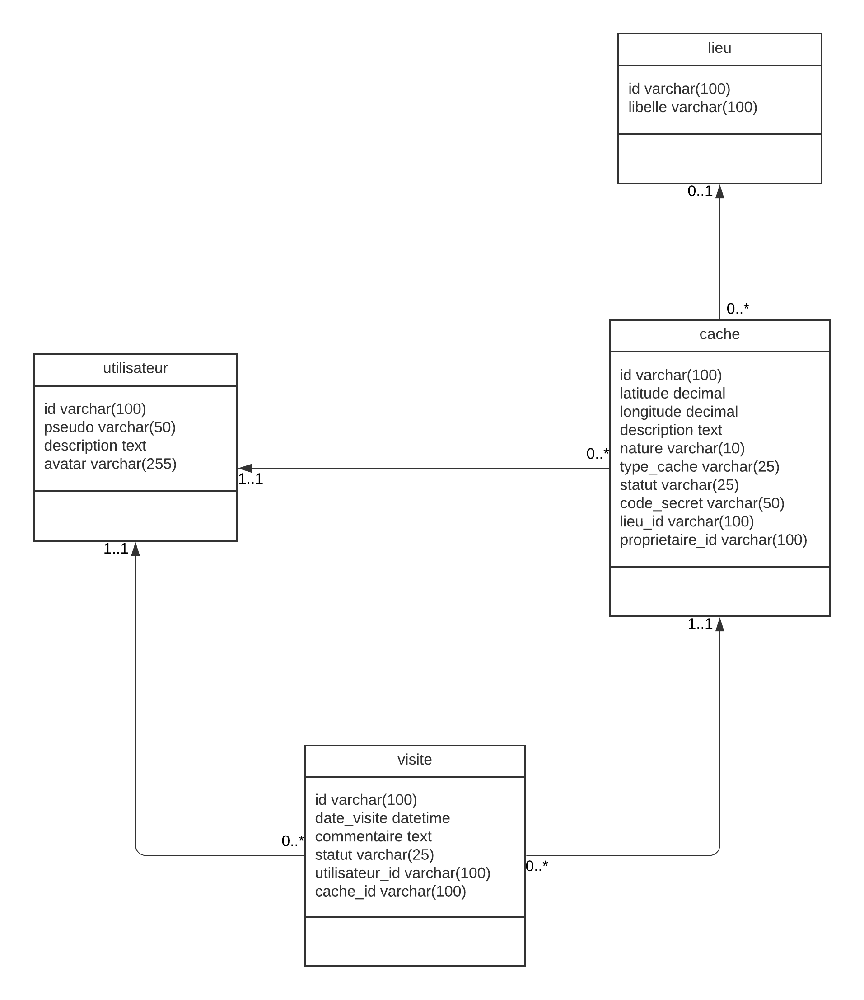

# LA2 - POO - GeoCache

Baptiste Pautrat & Gaston Deseine

GeoCache est une application java console à destinations de testeurs permettant de valider la robustesse et la souplesse de la couche d’accès aux données d’une application de gestion de GeoCaches

# Pré-requis

- Intellij Idea
- Java 15
- MySQL 5.7

## Installation

1. Récupérer le projet GitHub

   ```bash
   git clone https://github.com/GastonDeseineIG2I/la2-poo-geocache
   ```

2. Créer la base de données MySQL avec le fichier DDL ***geocache.sql***

3. Ouvrir le projet sur Intellij

4. Mettre à jour le fichier ***hibernate.cfg.xml*** en mettant les informations de connexion à la base de données à jour.

5. Lancer le projet en exécutant le main de la classe Main.java.


## Introduction


**<u>Sujet</u>  :** Développer une application java console à destinations de testeurs permettant de valider la robustesse et la souplesse de la couche d’accès aux données d’une application de gestion de GeoCaches.

Cf. : cahier des charges.


## Technologies utilisées

- Java 15.0.2
- Hibernate 5.4
- JPA 2.0
- MySQL 5.7


## Conception


### Architecture de base de données

#### Tables :

- Lieu : un lieu géographique définit par un libellé.

- Cache : informations permettant de situer et définir une cache.

- Utilisateur : information d'un utilisateur.

- Visite : lien entre un utilisateur et une cache.

  

#### Modèle UML :

#### 

#### SQL DDL

```mysql
create schema `la2-geocache` collate latin1_swedish_ci;

create table cache
(
	id varchar(100) not null
		primary key,
	latitude decimal(12,10) null,
	longitude decimal(13,10) null,
	description text null,
	nature varchar(10) not null,
	type_cache varchar(25) default 'traditionnelle' not null,
	statut varchar(25) default 'inactive' not null,
	code_secret varchar(50) not null,
	lieu_id varchar(100) null,
	proprietaire_id varchar(100) not null
);

create index cache_lieu_id_fk
	on cache (lieu_id);

create index cache_utilisateur_id_fk
	on cache (proprietaire_id);

create table lieu
(
	libelle varchar(100) not null,
	id varchar(100) not null
		primary key
);

create table utilisateur
(
	id varchar(100) not null
		primary key,
	pseudo varchar(50) not null,
	description text null,
	avatar varchar(255) default 'default.png' not null,
	constraint utilisateur_pseudo_uindex
		unique (pseudo)
);

create table visite
(
	id varchar(100) not null
		primary key,
	date_visite datetime null,
	utilisateur_id varchar(100) not null,
	cache_id varchar(100) not null,
	commentaire text null,
	statut varchar(25) default 'En cours' not null
);

create index visite_cache_id_fk
	on visite (cache_id);

create index visite_utilisateur_id_fk
	on visite (utilisateur_id);


```


## Nos choix

Voici les choix que nous avons réalisé : 


- Code secret associé a une cache qui permet de valider la visite par un utilisateur. Si le code n'est pas bon la visite n'est pas comptabilisé. Cela constitue une preuve de la visite.

- On stock l'avatar d'un utilisateur dans un répertoire. On indique le chemin vers l'avatar de l'utilisateur dans la base de donnée en temps que VARCHAR(255). Le fichier de l'avatar est nommé en concaténant le pseudo de l'utilisateur (unique) avec l'extension du fichier. Une image par défaut est attribué à l'utilisateur tant qu'il n'a pas défini la sienne.

- Nous avons fait le choix de réduire l'état d'une cache a inactif ou actif. Nous avons trouvé que en cours d'activation, fermée et suspendue était des sous catégories d'inactif. Nous avons jugé que nous n'avions pas besoin de ce niveau d'information.


- Pour les visites nous avons décidé que le statut serait soit en en cours soit terminée

- Au niveau de notre structure de code nous avons décidé de faire des repositories pour chacune de nos entités et nous avons aussi rajouté une interface RepositoryInterface pour y mettre les fonctions commune a nos différents repositories. Toute la partie graphique se fait dans notre fichier Menu. Se fichier et charger de contacter le bon repository pour avoir les informations.

## Description de la solution

- Notre solution est une interface console sur un premier menu vous pouvez sélectionner un grand domaine fonctionnel exemple Sur les caches / utilisateur .. Puis une fois le choix réalisé on allez avoir un autre menu ou vous allez pouvoir tester différentes fonctionnalités


## Difficultés

- Nous avons eu beaucoup de mal à mettre en place switch vers MongoDB, Le problème est que nous avons développé le projet tout d'abord avec MySQL et lorsque nous avons du passer à MongoDB nous avons du changer beaucoup de choses.


## Conclusion 

- Le projet à été très interessant car nous avons pu approfondir nos connaissances en JAVA / MongoDB.
 Ca a été très intéressant et très enrichissant de découvrir Hibernate car c'est quelque choses que nous ne connaissions pas du tout.
Il aurait été aussi interessant de le faire avec une vraie interface graphique pour voir comment cela s'implémente en JAVA cependant il aurait fallut plus de temps pour le réaliser. N'étant pas forcement à l'aise avec le JAVA / Hibernate heureusement que nous avions un peu de temps libre pour travailler aussi dessus.